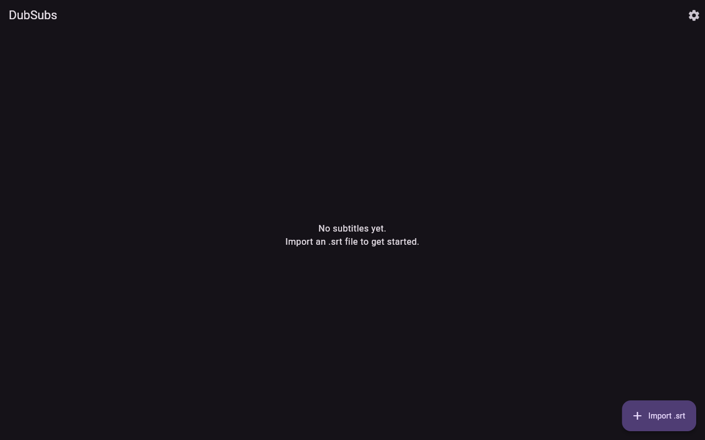
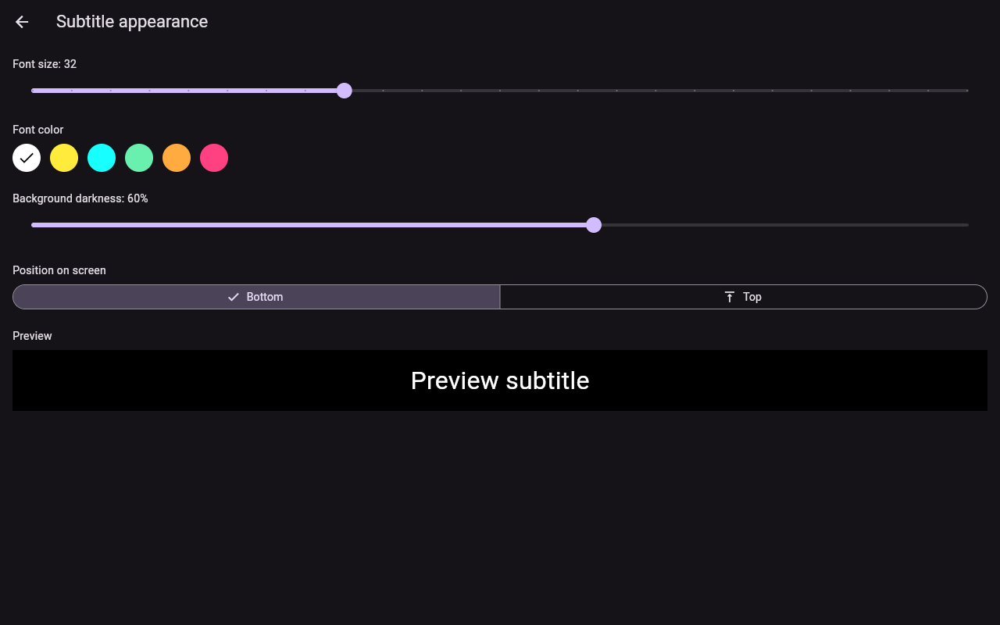

# DubSubs

An offline subtitle teleprompter for movies that are dubbed with no
subtitles available (e.g. English-subtitled screenings of Spanish-dubbed
films in local cinemas). Load an `.srt` file and DubSubs displays each line
on screen in time with the movie — you control the clock, not a video file,
since the movie itself is playing on a separate screen.

Works fully offline on **Android**, **iOS**, and **Web**. Built with
Flutter.

|                        |                          |
| ---------------------- | ------------------------ |
|  |  |

## Features

- **Import any `.srt` file** from local storage — no account, no internet
  required. Imported files are stored on-device so your library survives
  app restarts.
- **Play / pause** the subtitle timeline, plus **±5s / ±10s** jump buttons
  and a scrubber for fast-forwarding or rewinding subtitles to match what's
  happening on screen.
- **Tap-to-sync**: pick the exact line being spoken from a scrollable list
  and the whole timeline snaps to it — the reliable way to get (re-)synced.
- **Mic-assisted drift correction (optional, best-effort)**: DubSubs can
  listen for speech-vs-silence transitions in the room and nudge the
  timeline when a line is about to start near a detected speech onset. This
  is **not** speech recognition or audio fingerprinting — it can't
  understand words or match across languages (the room's dubbed audio and
  your subtitles are usually in different languages, and there's no
  reference audio track to fingerprint against). It's a lightweight assist
  on top of manual tap-to-sync, not a replacement for it. No audio is ever
  recorded to disk or sent anywhere; only its loudness is inspected in
  memory, in real time.
- **Customizable display**: font size, font color, background darkness, and
  top/bottom position, all persisted between sessions.

## Getting started

Requires the Flutter **stable** channel.

```bash
flutter channel stable
flutter upgrade
flutter pub get
```

Run it:

```bash
flutter run -d chrome    # Web
flutter run -d <device>  # Android / iOS device or emulator/simulator
```

## How syncing works

There's no video file inside the app — the movie plays on the cinema or TV
screen, and DubSubs just runs a clock you control:

1. Import your `.srt` file.
2. Hit play when the movie starts.
3. If it drifts out of sync, either jump by a fixed offset (±5s/±10s), drag
   the scrubber, or open **"Tap line to sync"** and tap the line being
   spoken right now — the timeline re-anchors to that line instantly.
4. Optionally toggle **sync assist** (the mic icon) to let DubSubs nudge
   the timeline automatically when it notices speech starting near an
   upcoming line. Keep tap-to-sync as your fallback — it's the one method
   that's always exactly right.

## Project structure

```
lib/
  models/     Plain data classes (SubtitleCue, SubtitleDocument, AppSettings)
  services/   SRT parsing, the sync clock, mic VAD assist, Hive storage, controllers
  screens/    Library, Player, Settings
  widgets/    Subtitle overlay, transport controls, tap-to-sync picker
```

## Testing

```bash
flutter analyze
flutter test
```

Unit tests cover the `.srt` parser and the sync clock's play/pause/seek/
offset math; widget tests drive the actual Player screen (tap-to-sync,
play/pause, malformed-file handling) through real user interactions.

## Roadmap ideas

- Online subtitle search (e.g. OpenSubtitles) as an alternative to manual
  `.srt` import.
- Adjustable playback speed for long-term drift correction.

## License

[MIT](LICENSE)
